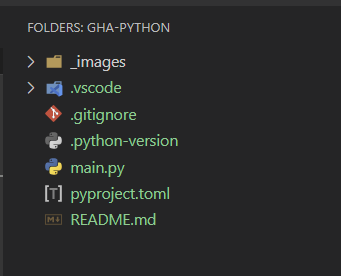
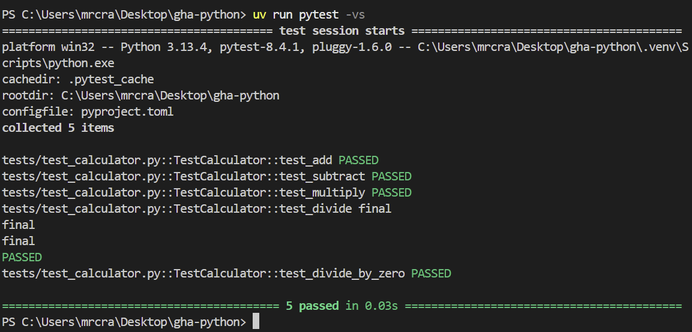

# Versions

*Notes for Craig*

v1.0.0 - Basic set up to run src and tests

v1.1.0 - has precommit hooks testing for:

      - id: trailing-whitespace
      - id: end-of-file-fixer
      - id: check-yaml
      - id: check-added-large-files
      - id: check-merge-conflict

      - id: ruff

v1.2.0 - Added conventional commits.

v1.3.0 - Added MyPy in precommit.

v1.4.0 - Added custom script `scan_secrets.py` and added pre-commit hook to scan secrets.

v1.4.1 - Updated versions in precommit.

v2.0.0 - consolidate to a v2.0.0

v2.1.0
- has the GHA `uv_run_lint_tests_calc_matrix_security.yaml` OK
- has the GHA `docker_validate_build_scan_deploy.yaml` OK (added secrets)

--------------------------------------------------------------------

# Set up

With a blank folder and just `.vscode` in it, run: `uv init`

This gives:



It will have a `.python-version` file with current system Python version.

You can use `uv` to run Python projects with different Python versions. Here's how:

## 1. Run with a specific Python version directly

```bash
# Run with Python 3.9
uv run --python 3.9 your_script.py

# Run with Python 3.11
uv run --python 3.11 your_script.py

# Run with exact version
uv run --python 3.9.18 your_script.py
```

## 2. Create a virtual environment with specific Python version

If you don't create it specifically, one will be created `.venv` folder. This is also created with `uv venv`.

```bash
# Create venv with Python 3.9
uv venv --python 3.9

# Activate it
source .venv/bin/activate  # On Windows: .venv\Scripts\activate

# Install dependencies
uv pip install -r requirements.txt

# Run your project
python your_script.py
```

## 3. Use uv sync with specific Python version

If you have a `pyproject.toml` file:

```bash
# Sync dependencies with Python 3.9
uv sync --python 3.9

# Then run
uv run your_script.py
```

## 4. Install Python version if needed

```bash
# uv can install Python versions for you
uv python install 311

# Then use it
uv run --python 3.11 src/calculator/calculator.py
```

Ensure `pyproject.toml` has suitable `requires-python = ">=3.11"` etc...

## 5. Set Python version in pyproject.toml

Add to your `pyproject.toml`:
```toml
[tool.uv]
python = "3.9"
```

Then simply run:
```bash
uv run your_script.py
```

The `--python` flag is the quickest way to specify a different Python version with uv. It will automatically download the Python version if it's not available on your system.

## Copy files

Copy over `src` and `tests` folders.

If you are using a different Python version in the `pyproject.toml` to that in `.python-version` then change the `.python-version` file to match the one in `pyproject.toml`.

`.\src\calculator\calculator.py` runs the script.


# Sync

`uv sync` will sync your dependencies to the latest versions. It will also sync the Python version if needed.

`uv add --dev pytest` will add pytest to your project as a dev dependency.

`uv add pandas` will add pandas to your project as a regular dependency.

# Run tests

`uv run pytest -vs` will run pytest with verbose output.




# Change Python version

`uv python pin 3.12` will pin your Python version to 3.12.

You can change in `pyproject.toml` if you want to change project.

# Remove existing venv
delete `.venv` folder

# Create new venv with different Python version
uv venv --python 3.12

# Reinstall dependencies
uv sync

# List PyPi packages

`uv python list  | Select-String "3\."` (windows)

# Ruff
`uv run ruff check src` will run ruff.

`uv run ruff check --fix src` will run ruff and fix issues.

`uv run ruff format src` will run ruff and fix issues.

# Pre-Commit

To add pre-commit for Python with `uv`:

## 1. Add pre-commit as a dev dependency

```bash
# Add pre-commit as dev dependency
uv add --dev pre-commit
```

## 2. Create .pre-commit-config.yaml

Create a `.pre-commit-config.yaml` file in your project root:

```yaml
repos:
  - repo: https://github.com/pre-commit/pre-commit-hooks
    rev: v4.4.0
    hooks:
      - id: trailing-whitespace
      - id: end-of-file-fixer
      - id: check-yaml
      - id: check-added-large-files
      - id: check-merge-conflict

  - repo: https://github.com/astral-sh/ruff-pre-commit
    rev: v0.1.6
    hooks:
      - id: ruff
        args: [--fix]
      - id: ruff-format

  - repo: https://github.com/pre-commit/mirrors-mypy
    rev: v1.7.1
    hooks:
      - id: mypy
```

## 3. Install the pre-commit hooks

```bash
# Install pre-commit hooks
uv run pre-commit install

# Install for commit-msg hook (optional)
uv run pre-commit install --hook-type commit-msg
```

## 4. Run pre-commit

```bash
# Run on all files
uv run pre-commit run --all-files

# Run on staged files only
uv run pre-commit run

# Update hooks to latest versions
uv run pre-commit autoupdate
```

## 5. Alternative: Use uvx for one-time setup

```bash
# Install pre-commit hooks without adding to project
uvx pre-commit install

# Run pre-commit
uvx pre-commit run --all-files
```

## 6. Test the setup

```bash
# Make a commit to test hooks
git add .
git commit -m "Test pre-commit hooks"
```

The hooks will now run automatically on every commit. The `uv run pre-commit install` command is the key step that sets up the Git hooks.

# Conventional commits

`uv add --dev conventional-pre-commit`

`uv run pre-commit install --hook-type commit-msg`

types:
  - feat
  - fix
  - docs
  - style
  - refactor
  - test
  - chore
  - ci
  - build
  - perf
  - revert

scopes:
  - api
  - ui
  - auth
  - db
  - config

optional_scopes: true

# Valid commit messages
git commit -m "feat: add user authentication"
git commit -m "fix: resolve database connection issue"
git commit -m "docs: update README with setup instructions"
git commit -m "feat(auth): implement JWT token validation"
git commit -m "fix(db): handle connection timeout errors"
